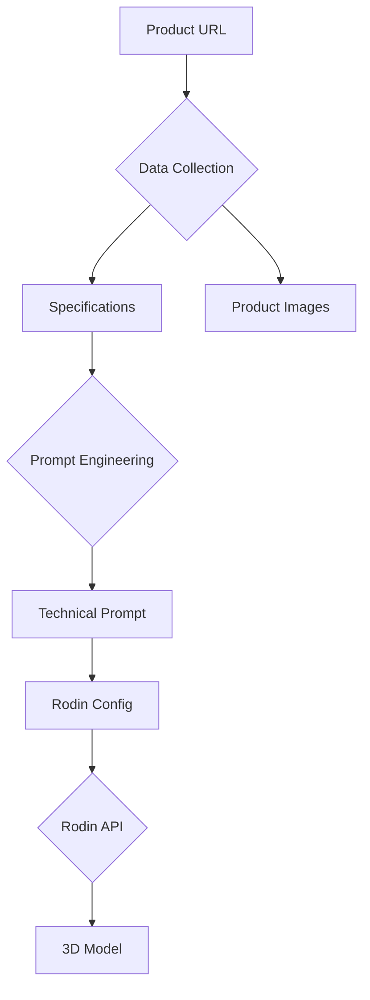

```markdown
# Hyper-Realistic Eyeglasses 3D Generator

A pipeline for creating photorealistic 3D models of Warby Parker eyeglasses using product pages and AI-powered 3D generation.

## Features

- **Automated Web Scraping**: Extracts product specifications from Warby Parker product pages
- **Intelligent Prompt Engineering**: Generates detailed 3D modeling prompts using DeepSeek LLM
- **High-Fidelity 3D Generation**: Produces production-quality models with Rodin API
- **Modular Architecture**: Clean separation of components for easy maintenance
- **Quality Assurance**: Built-in logging and validation at every stage

## Technical Architecture



## Modules

### 1. Data Collection
- **Web Scraping**: Extracts product specs using Playwright and LangChain
- **Image Extraction**: Captures product image URLs from page HTML
- **Content Transformation**: Converts HTML to clean text documents

### 2. Prompt Engineering
- **Specs Processing**: Structures product data for 3D modeling
- **LLM Integration**: Uses DeepSeek for technical prompt generation
- **Config Creation**: Produces Rodin API-ready JSON configurations

### 3. 3D Generation
- **Rodin Integration**: Handles API communication with FAL
- **Model Processing**: Manages 3D generation jobs and results
- **Quality Control**: Validates output models and textures

## Installation

### Requirements
- Python 3.10+
- FAL API Key
- DeepSeek API Key

### Setup
```bash
# Clone repository
git clone https://github.com/yourusername/warby-3d-generator.git
cd warby-3d-generator

# Create virtual environment
python3 -m venv venv
source venv/bin/activate

# Install dependencies
pip install -r requirements.txt

# Setup Playwright browsers
playwright install chromium

# Configure environment
cp .env.example .env
# Edit .env with your API keys
```

## Configuration

### Environment Variables (`.env`)
```ini
FAL_KEY="your_fal_key"
DEEPSEEK_API_KEY="your_deepseek_key"
LOG_LEVEL="INFO"
```

### Settings (`config/settings.yaml`)
```yaml
rodin:
  quality: high
  material: PBR
  addons: HighPack

paths:
  raw_images: data/raw_images
  processed_images: data/processed_images
```

## Usage

### Generate 3D Model
```bash
python main.py "https://www.warbyparker.com/eyeglasses/your-product"
```

### Expected Outputs
```
data/
├── raw_images/         # Original downloaded images
├── processed_images/   # Enhanced images
├── prompts/            # Generated technical prompts
├── configs/            # Rodin API configurations
└── 3d_models/          # Final GLB models with textures
```

### Run Tests
```bash
python -m tests.test_product_scraper
```

## Troubleshooting

### Common Issues
1. **SSL Errors**:  
   `pip install --upgrade certifi`

2. **API Limits**:  
   Check balances:
   - DeepSeek: https://platform.deepseek.com/usage
   - FAL: https://fal.ai/dashboard

3. **Empty Outputs**:  
   Run with debug logging:
   ```bash
   python main.py --log-level DEBUG
   ```

4. **Playwright Issues**:  
   Reinstall browsers:
   ```bash
   playwright install
   ```

## Limitations
- Dependency on Warby Parker website structure
- Requires high-quality product images (min 2048px)
- API costs apply for generation jobs

## License
MIT License

## Acknowledgments
- FAL.ai for Rodin 3D generation
- DeepSeek for LLM capabilities
- LangChain for web scraping tools
```
